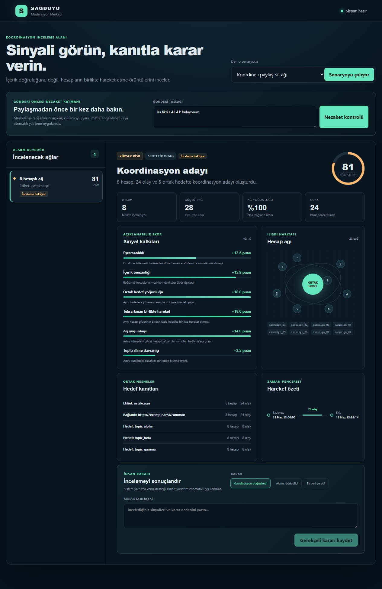
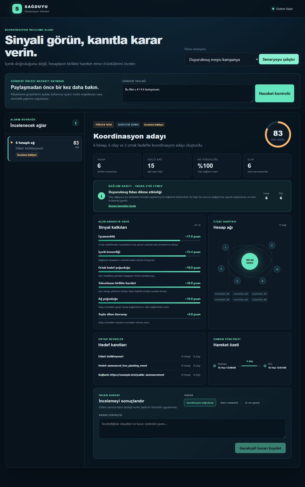
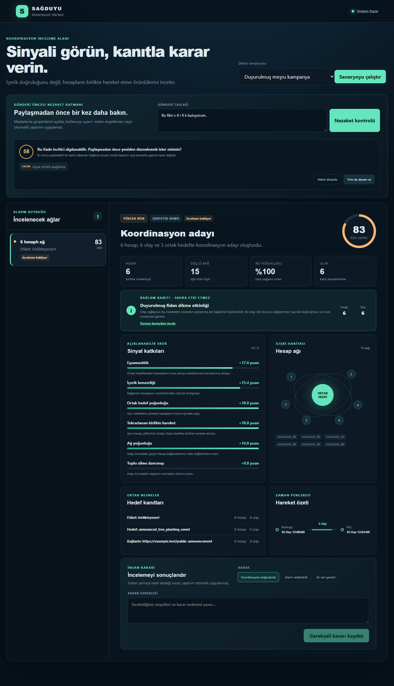
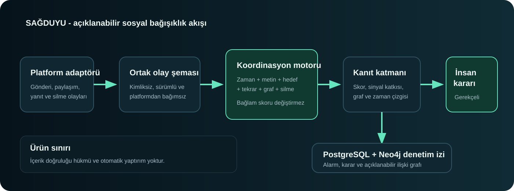

# Demo ve Ölçüm Kanıtı

Bu paket, çalışan prototipin temel yollarını tek komutla doğrular. Yalnız toplu
sonuç üretir; ham olay, kişisel veri, metin gövdesi veya gizli bilgi kaydetmez.

## Tek komut doğrulama

Geliştirme bağımlılıkları kurulduktan sonra proje kökünde:

```bash
python scripts/run_demo_evidence.py --output artifacts/demo-evidence.json
```

Komut aşağıdaki kabul kontrollerinden biri başarısız olursa sıfırdan farklı
çıkışla durur:

| Senaryo | Beklenen olay | Beklenen alarm | Ek kontrol |
|---|---:|---:|---|
| Koordineli paylaş-sil ağı | 30 | 1 | Risk, graf düğüm/bağ özeti ve gerekçeli karar kaydı |
| Organik tartışma | 12 | 0 | Alarm eşiğini aşmama |
| Duyurulmuş meşru kampanya | 6 | 1 inceleme adayı | Skoru değiştirmeyen duyuru bağlamı |
| Maskeli Türkçe nezaket örneği | 1 metin | Uyarı | `salak` kanoniği ve devam etme seçimi |

Çıktıdaki gecikme, aynı süreçte çalışan FastAPI test istemcisinin 30 tekrarından
p50, p95 ve en yüksek değer olarak hesaplanır. Bu değer yalnız yerel smoke
ölçümüdür; üretim yük testi olarak yorumlanmaz. Docker tam-yığın ölçümü ayrı
ortam bilgisiyle raporda belirtilir.

### Doğrulanmış tam-yığın smoke ölçümü

| Ortam | İstek | p50 | p95 | En yüksek | Kapsam |
|---|---:|---:|---:|---:|---|
| Windows 11 ana makine, Docker Desktop 29.4.2, PostgreSQL 17, Neo4j 5.26 | 30 | 65,4 ms | 88,6 ms | 102,6 ms | Yerel ardışık tekrar oynatma; üretim yük testi değil |

Bu ölçüm temiz imaj yapısı sonrasında API konteynerine gönderilen koordineli
senaryo isteklerinden alınmıştır. Ağ trafiği, eşzamanlı kullanıcı ve uzun süreli
yük içermediği için yalnız prototip gecikme kanıtıdır.

## Jüri demo sırası

1. Koordineli paylaş-sil ağı çalıştırılır; alarm kuyruğu, sinyal katkıları,
   ilişki grafı, ortak hedefler ve zaman penceresi gösterilir.
2. Duyurulmuş kampanya çalıştırılır; skorun korunduğu ve duyuru kaynağının
   yalnız insan incelemesine bağlam sunduğu açıklanır.
3. Organik tartışma çalıştırılır; alarm üretilmediği gösterilir.
4. Maskeli Türkçe metin nezaket alanında kontrol edilir; gerekçe ile
   düzenle/devam et seçenekleri gösterilir.
5. Koordinasyon adayına gerekçeli moderatör kararı kaydedilir ve denetim izi
   doğrulanır.

## Kullanılabilirlik ve erişilebilirlik kontrol listesi

| Kontrol | Durum | Kanıt |
|---|---|---|
| Klavye ile form ve buton erişimi | Geçti | Yerel tarayıcı kontrolü ve semantik HTML öğeleri |
| Görünür alan etiketleri | Geçti | Form `label`, bölge `aria-label` ve başlık ilişkileri |
| Yükleniyor, boş, hata ve başarı durumları | Geçti | Ayrı durum bileşenleri ve canlı bölge rolleri |
| Azaltılmış hareket tercihi | Geçti | `prefers-reduced-motion` medya kuralı |
| Dar ekran yerleşimi | Geçti | 760 px ve 520 px duyarlı kırılımlar |
| Otomatik yaptırım uyarısı | Geçti | İnsan kararı panelinde açık ürün sınırı |
| Bağlamın skordan ayrılması | Geçti | Bağlam kartı ve motor regresyon testi |

Bu liste uzman erişilebilirlik denetimi veya gerçek kullanıcı çalışmasının
yerine geçmez. Üretim pilotundan önce ekran okuyucu, kontrast ve görev tamamlama
testleri gerçek katılımcılarla tekrarlanmalıdır.

## Görsel kanıtlar

### Koordinasyon kanıt ekranı



### Duyurulmuş kampanya bağlamı



### Maskeli Türkçe nezaket uyarısı



### Sistem mimarisi


